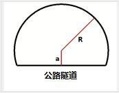
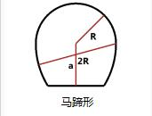
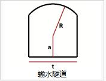

# 基于蚁群算法的三臂凿岩机器人动态孔序规划 
Dynamic Sequence Planning of three-boom Tunnel Drilling Robot with Ant Colony Algorithm
matlab version: 2016a
the mian function: GuiTest.m
This is the codes of my master's degress about **Dynamic Sequence Planning of three-boom Tunnel Drilling Robot with Ant Colony Algorithm**, and I designed a GUI for planning. Because of the project paused, I didn't apply this GUI to the real three-boom Tunnel Drilling Robot. Almost one year passed, that project had been acoomplished, while I graduated almost one year.
This program contain three classic Tunnels for planning, also you can design your own Tunnel.

What you need to note is you should take care of the version of the matlab, i just have a try with the version 2019a, and without doubt I got errors. So if you got errors, try matlab 2016a

* road Tunnel (公路隧道):

* horse shoe tunnel (马马蹄形隧道):

* water tunnel (排水隧道)：

